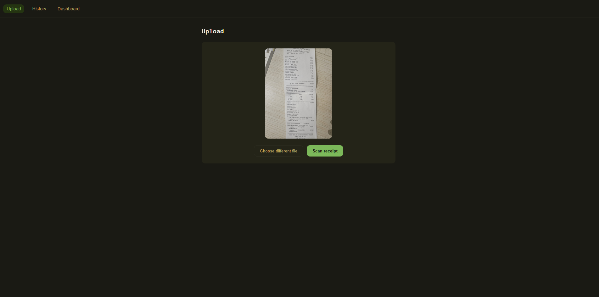
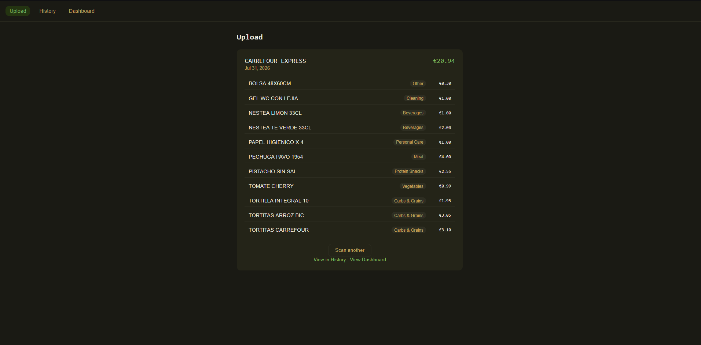
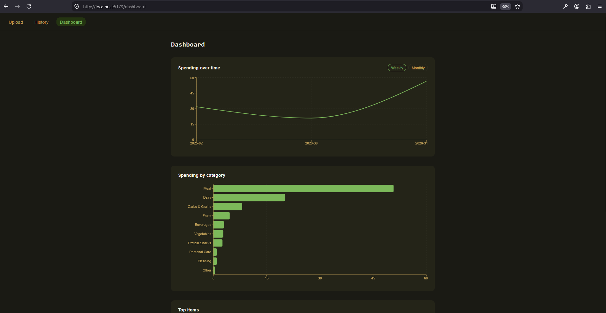
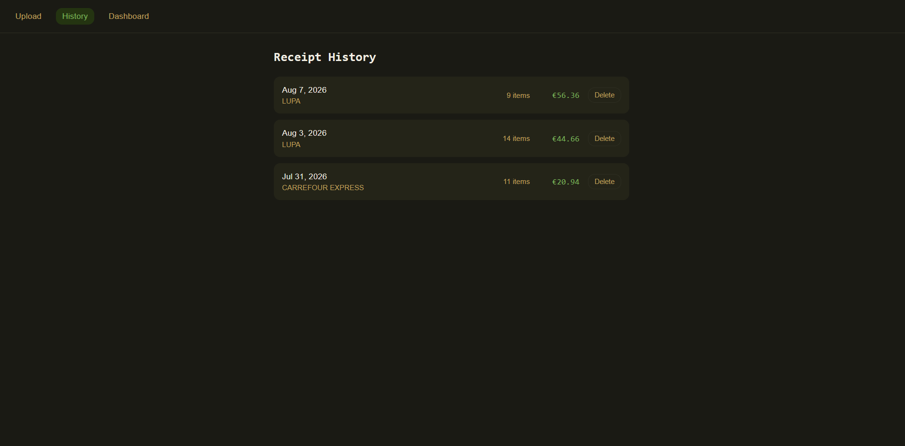

# Canasta

A local-first grocery intelligence app. Scan a supermarket receipt and Canasta pulls out every item, price, and category. Then it turns a stack of receipts into an actual picture of what you buy.

## Why I built this

I go to the supermarket often, and I never had a clear picture of what I actually buy most, I just knew that I went too often and sometimes I ended up with too many of the same product. Canasta started from that: scan a receipt, get real data back and have a clearer view of my habits.

## What it does

- **Scan a receipt**: upload a photo and Google Gemini (Vision) extracts the store, date, every line item, price, and a category, automatically.
- **Cross-store product matching**: fuzzy name matching recognizes that near-identical product names from different stores are the same product, so spending totals aren't split across variants.
- **Dashboard**: spending over time (weekly or monthly), spending by category, and a top-items ranking.
- **Item drill-down**: click any product to see its full purchase history: every time you bought it, where, and for how much.
- **Receipt history**: a log of every scan, with delete.

## Screenshots

Here you can find a preview of Canasta working.

- **Upload Page**
  
  
- **Dashboard**
  
- **History**
  

## Tech Stack

- **Backend:** FastAPI + SQLAlchemy + SQLite
- **Frontend:** React + Vite + TypeScript, Recharts for charts
- **LLM:** Google Gemini (Vision) via the `google-genai` SDK
- **Tests:** pytest (backend)

## Prerequisites

- Python 3.13+
- Node.js 18+
- A Google Gemini API key

## Setup

```bash
# Clone and enter the project
git clone <repo-url> && cd canasta

# Backend
python -m venv .venv
source .venv/bin/activate   # Windows: .venv\Scripts\activate
pip install -r requirements.txt

# Add your Gemini API key
cp .env.example .env
# Edit .env and set GEMINI_API_KEY to your actual key

# Frontend
cd frontend && npm install && cd ..
```

## Running

```bash
# Terminal 1: backend (localhost:8000)
uvicorn backend.main:app --reload

# Terminal 2: frontend (localhost:5173)
cd frontend && npm run dev
```

Open [http://localhost:5173](http://localhost:5173) in your browser.

## Testing

```bash
pytest
```

## Under the Hood

A technical tour through how each piece works, roughly in build order:

- **Receipt scanning**: a receipt photo is sent to Gemini Vision with a prompt that constrains it to strict JSON; the response is parsed and validated, and category strings are mapped to a fixed enum through a lookup table rather than trusted as free text.
- **Duplicate & upsert handling**: a composite unique constraint on `(date, store, total)` catches a receipt scanned twice; re-adding the same item name within a receipt UPSERTs its quantity and total instead of inserting a duplicate line.
- **Cross-store product matching**: names are cleaned (lowercased, store-specific codes stripped via regex) and fuzzy-matched against existing normalized names with `rapidfuzz`'s `token_set_ratio` at an 85% threshold, so "YOPRO DRINK 300" and "YoPro Bebida Danone" collapse into one tracked product.
- **Analytics**: spending-over-time, by-category, and top-items are plain SQL aggregations (`SUM`/`GROUP BY`); SQLite has no native `DATE_TRUNC`, so weekly/monthly bucketing uses `strftime`.
- **Item drill-down**: one endpoint joins `Item`↔`Receipt` and returns both the aggregate stats and the full purchase list in a single round trip.
- **Rate-limit awareness**: Gemini's free-tier request limits are tracked client-side (a rolling window kept in `localStorage`), surfacing a non-blocking warning before the ceiling is hit.

Every feature also started as a written spec before any code: `spec/features/NNN-name/` holds what it does, how it's implemented, and a task checklist, with `spec/constitution/` holding the project-wide rules (mission, tech stack, roadmap).

## Project Structure

```
canasta/
├── backend/
│   ├── main.py            # FastAPI app entry point, all routes
│   ├── database.py        # SQLAlchemy engine & session
│   ├── models.py          # Receipt & Item ORM models
│   ├── schemas.py         # Pydantic validation schemas
│   ├── scanner.py         # Gemini Vision integration
│   ├── normalizer.py      # Cross-store product name matching
│   └── tests/             # Backend tests (pytest)
├── frontend/
│   └── src/
│       ├── App.tsx        # Routes
│       ├── pages/         # Upload, History, Dashboard, ItemDetail
│       ├── components/    # NavBar
│       ├── api/           # Typed fetch clients per backend resource
│       ├── lib/           # Client-side utilities (e.g. rate-limit tracking)
│       └── styles/
│           └── tokens.css # Dark theme design tokens
├── spec/                  # Feature specs, written before each feature's code
└── requirements.txt
```

## Design Principles

- **Local-first**: all data stays on your machine in a SQLite file. No accounts, no cloud, no tracking.
- **Receipt images are never stored**: only the extracted data is kept; the photo is discarded right after Gemini reads it.
- **Single user by design**: no auth in v1, since this runs on your own machine for your own groceries.

## License

MIT, see [LICENSE](LICENSE).
